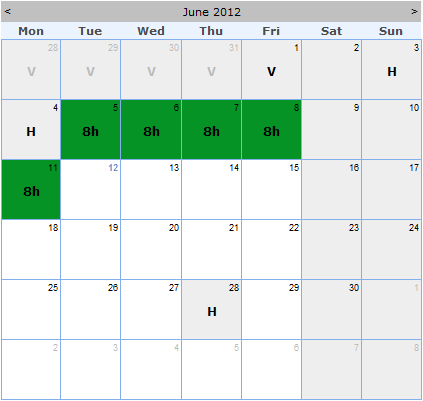

1. Проанализировать объекты  и разобраться со структурой БД.
2. Создать отчет, который бы показывал календарь доступности и загрузки ресурса на месяц в следующем виде (картинка только для примера как должен выглядеть календарь):  

В каждом квадрате (дне) вывести следующую информацию: 
а). Возможное количество часов загрузки ресурса,
б). Количество назначенных часов,
в). Количество отрапортованных часов (на статус тайм-шита не обращать внимание).

Праздники игнорируем, типы тайм-шитов учитывать – разделять время на рабочее и административное и т.д. Цветовые индикаторы продумать самому и отобразить «легенду».

Обеспечить детализацию для каждого квадрата (Drill-Down report), которая должна показывать на какой проект и задачу назначен ресурс, и на что было отрапортовано время.

Предложить вариант реализации такого отчета сразу по нескольким сотрудникам – можно не делать сам отчет – только мысли по этому поводу.

3. Данное задание позволит оценить следующие моменты:
а). Способность к декомпозиции и анализу данных,
б). Владение языком SQL,
в). Умение проектировать и создавать отчеты,
г). Способность «додумывать мелочи» за заказчиком.
